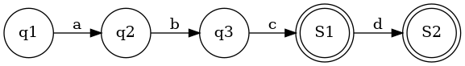
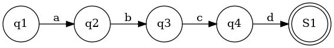

# FST

FST=Trie(前缀压缩)+后缀压缩

FST优化Trie的同时,也带来了新的问题.否则还要Trie干嘛.

## FST vs Trie

1. Trie只适合英文
2. FST能压缩前缀和后缀. Trie只能压缩前缀
3. Trie对插入顺序无所谓,但是FST要求必须按字母顺序插入
4. FST主要用在放硬盘里,Trie的序列化到硬盘没见过
5. FST加入之后很难修改/删除.Trie的修改和删除容易一点 

FST修改/删除=重新构建一个FST.删除不能简单的做个标注,因为你要考虑不同路径来的都删除了.

https://www.cnblogs.com/bonelee/p/6226185.html

------

## 用FST能做什么?

- 有序集合
- 有序dictionary (value需要定义运算符,比如整数的加法)

FST与存储相关联.如果只在内存中,不如用无序的hashmap或者有序的BTree.

存储可以是硬盘,socket或者内存.反正是Rust中writable的东西

------

## FST vs BTreeSet,BTreeMap

Rust标准库里有  BTreeSet 和 BTreeMap. 他们是有序的集合和有序的map.

FST也是有序的.那么他们的区别是

1. FST中key只能是byte sequences. 必须能用[u8] 表示. BTreeSet和BTreeMap中key只要能序列化就行
2. FST中value暂时只能是u64. 顶多支持能定义+的格式比如字符串. BTreeMap没有限制
3. BTreeSet和BTreeMap的插入,不需要按照顺序.但是FST必须是按顺序插入.不按顺序插入会报错.也就是说FST没有很好的动态扩展性

------

## FST vs gzip

1. 压缩时间和压缩率上,gzip都比FST好
2. 但是FST能在上面做搜索

------

## FST 如何压缩后缀的

首先要求按字母顺序的插入.否则只能重新构建.现在FST的实现也是这样的.

难点在于,一个点从unfinished变成finished, 如何判断相同的状态已经出现过了.

### 如何判断两个点是不是一样的 ?

1. 是否同时是终态,或者同时不是终态
2. 所有的儿子是不是一样
3. 去每个儿子的路径上面的字母(如果是map,还是u64),是不是一样

只有3个条件都满足,才能合并.

如果点的数量不大,可以一个一个条件去比较. 但如果数量太多,最好能压缩一下状态.FST用了一个cache压缩状态,就是把所有条件都xor起来,变成一个u64.

------

## 例子

如上图,插入的是abc 和 abcd 两个单词,就会有两个终止状态.FST中不一定只有一个终止状态.也就是说,如果插入的两个单词有前缀关系,就会出现多个终止态.

FST插入一定要按照字典序,例如必须先插入abc,再插入abcd.

如果先插入了abcd,即下图

再插入abc,对于状态4来说,就有点尴尬了.一个普通状态要变成终止态?

------

我们再看一个插入顺序的问题,导致发生严重后果的例子.首先我们插入thursday和wednesday.现在的FST是正确的.

如果我们再插入一个单词 thurs ,变成下图

副作用是 wednes 也在这个FST中. 这不是我们想要的

我们正确的插入顺序是 thurs thursday wednesday ,FST图应该是这样

注意S2和q14是不同的两个点.不能捏在一起.

## FST 的编程实现

1. 在现有的FST 中,找到最长前缀.前缀压缩总是安全的,就算路过终态也没关系.终态的点也可以复用.

   

最后一个单词的每一个节点,都是 BuilderNodeUnfinished . BuilderNodeUnfinished 表示这个点还可能有新的儿子节点.只有一个节点,不会在生出新的儿子节点,才可能从后缀开始合并.

## 原则

- 一个点只可能unfinished转成finished,不可能finished转成unfinished
- 起点总是非终态的。直到全部完成
- 总有一个终态对象是可以复用的

FST的美妙之处在于,虽然没有太刻意的处理前缀,但是前缀还是压缩了.

## 如何学习FST

fst-bin 目录提供的二进制可以把fst文件转成graphviz格式,然后可以画出图片.参见 `fst -h` 

如果你想知道某几个输入之后的FST的形状,可以用它画一画.

## FST如何序列化

todo 有点绕,不想看了.反正没用serde

## FST如果做模糊搜索的(Levenshtein,regex)

todo

## Tantivy中的FST

tantivy中FST用来存term

tantivy魔改了FST,我还没细看.为什么要魔改,我也不清楚

## 参考文献

https://blog.burntsushi.net/transducers/
